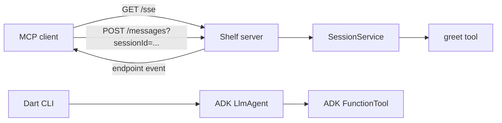

# Build a Dart ADK Agent and MCP Server

Dart developers do not need a Python or Node.js service just to experiment with agents and Model Context Protocol (MCP) tools. This project uses `adk_dart` for the agent and `shelf` for a small HTTP server that exposes an MCP-compatible greeting tool over Server-Sent Events (SSE).

The complete code is in the [adk-hello-world-dart repository](https://github.com/xbill9/adk-hello-world-dart).

## What the sample contains

The repository has two related examples:

- `bin/main.dart` creates an `LlmAgent` and registers an ADK `FunctionTool`.
- `bin/server.dart` starts a Shelf server with an SSE endpoint and a JSON-RPC message endpoint.

The server implements the MCP methods needed by this demo: `initialize`, `notifications/initialized`, `ping`, `tools/list`, and `tools/call`. The transport and JSON-RPC routing are deliberately small and live in `SessionService`; they are not a general-purpose MCP server implementation.



## 1. Add the dependencies

The current project targets Dart 3.5 or later and uses these package versions:

```yaml
environment:
  sdk: ^3.5.0

dependencies:
  adk_dart: ^2026.7.24
  adk_mcp: ^2026.7.24
  logging: ^1.3.0
  shelf: ^1.4.1
  shelf_router: ^1.1.4
  uuid: ^4.5.1
```

Install them with:

```bash
dart pub get
```

`adk_dart` is used directly by the sample agent. The repository also tracks `adk_mcp`, while the current server keeps its MCP transport explicit in `SessionService` so the protocol flow is easy to inspect.

## 2. Define the greeting tool

The project keeps the greeting logic separate from its ADK and MCP wrappers:

```dart
class Tools {
  static String formatGreeting(String name) {
    return 'Hello, $name!';
  }

  static final FunctionTool greetFunctionTool = FunctionTool(
    name: Config.toolGreet,
    description: 'Get a greeting from a local HTTPS server.',
    func: ({String? param}) {
      final name = param ?? 'World';
      return formatGreeting(name);
    },
  );
}
```

`Tools` also exposes an MCP tool definition with a JSON Schema input named `param`. Keeping `formatGreeting` as a plain Dart function makes the domain behavior easy to unit test.

## 3. Create the ADK agent

`AdkGreetingAgent` attaches the function tool to an `LlmAgent`:

```dart
class AdkGreetingAgent {
  static LlmAgent createAgent() {
    return LlmAgent(
      name: 'GreetingAgent',
      description: 'An AI Agent built with adk_dart that provides greetings.',
      instruction:
          'You are a friendly greeting assistant. '
          'Use the greet tool to provide personalized greetings.',
      tools: [Tools.greetFunctionTool],
    );
  }
}
```

Run the CLI example to confirm that the agent and tool can be created:

```bash
dart run bin/main.dart
```

This command initializes the agent and prints a sample tool result. It does not call a hosted model.

## 4. Expose the MCP endpoints

The Shelf server registers four routes:

```dart
router.get('/', (request) => Response.ok('ADK & MCP Dart Server Running'));
router.get('/health', (request) => Response.ok('OK'));
router.get(Config.sseEndpoint, sessionService.handleSseSession);
router.post(Config.messagesEndpoint, sessionService.handlePostMessage);
```

When a client opens `GET /sse`, `SessionService` creates an in-memory session and sends an `endpoint` event containing a URL such as:

```text
/messages?sessionId=7c6d...
```

The client posts JSON-RPC requests to that URL. Responses arrive as `message` events on the original SSE connection.

Start the server with:

```bash
dart run bin/server.dart
```

It listens on port `8080` by default. Set the `PORT` environment variable to use another port.

## 5. Connect an MCP client

For an MCP client that supports remote SSE servers, point it at:

```text
http://localhost:8080/sse
```

A typical client configuration looks like this:

```json
{
  "mcpServers": {
    "dart-greeting-server": {
      "url": "http://localhost:8080/sse"
    }
  }
}
```

Configuration keys differ between MCP clients, so check the documentation for the client you use. Once connected, call the `greet` tool with:

```json
{
  "param": "Dart developer"
}
```

The result is `Hello, Dart developer!`.

## 6. Test and verify the project

The repository includes unit tests for the greeting behavior and endpoint tests for the Shelf server:

```bash
dart test
dart analyze
```

You can run the complete build, analysis, and test sequence with:

```bash
make check
```

## 7. Build the container

The included multi-stage Dockerfile compiles the server to a native executable and copies it into a small scratch image:

```bash
docker build -t adk-hello-world-dart .
docker run --rm -p 8080:8080 adk-hello-world-dart
```

Check the running container at `http://localhost:8080/health`.

## 8. Deploy to Cloud Run

`cloudbuild.yaml` builds the image, pushes it to Container Registry, and deploys the service in `us-central1`:

```bash
make deploy
```

The deployment allows unauthenticated access and sets `--max-instances 1`.

That instance limit matters here. Active SSE transports are stored in a process-local map, so a POST request routed to another instance would not find its session. A production service should move session state to shared storage or use a transport and deployment design that does not depend on process-local routing. Authentication, origin restrictions, request validation, timeouts, and rate limiting would also need attention before exposing the service publicly.

## Where to go next

This sample is intentionally narrow: one agent, one deterministic tool, and enough MCP handling to show the request flow. Useful next steps include replacing the greeting with real domain logic, using `adk_mcp` transport primitives as the Dart package evolves, adding model configuration to execute the agent, and moving session state out of memory before scaling the service.

Resources:

- [Source repository](https://github.com/xbill9/adk-hello-world-dart)
- [adk_dart on pub.dev](https://pub.dev/packages/adk_dart)
- [adk_mcp on pub.dev](https://pub.dev/packages/adk_mcp)
- [Model Context Protocol](https://modelcontextprotocol.io)
